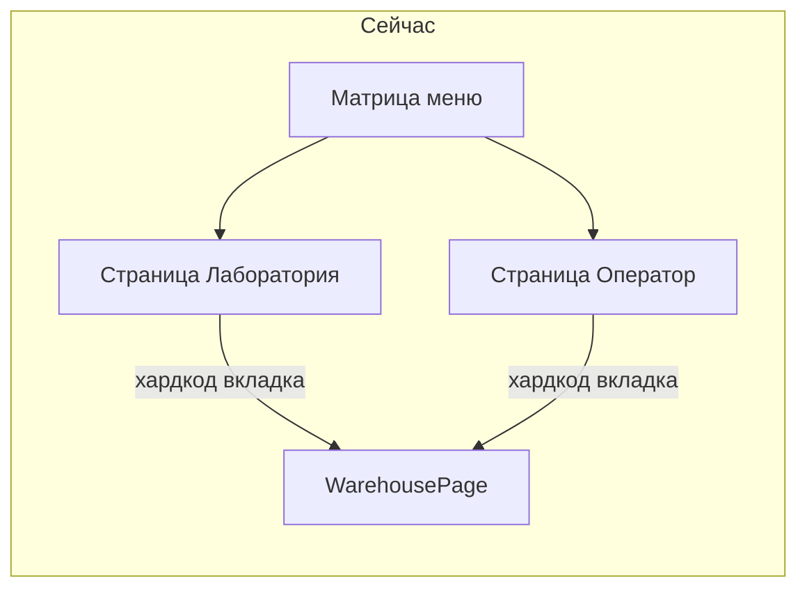
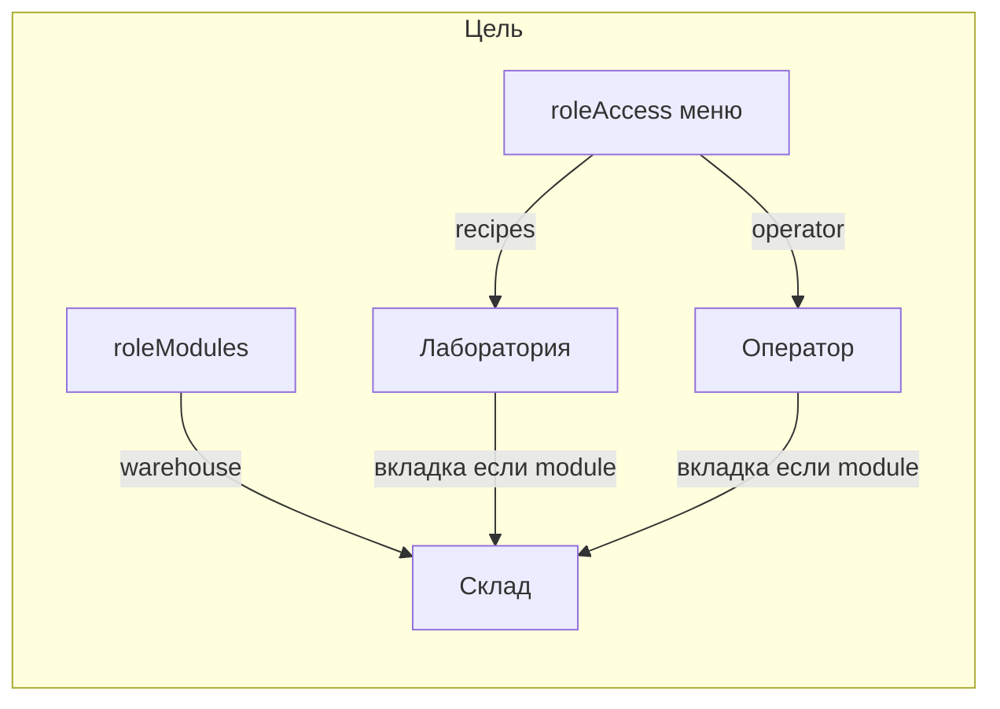

> **Архив.** Не в работе. Когда скажешь — достанем и сделаем.

# Матрица: меню + модули (вкладки)

## В чём проблема сейчас

Матрица «Права по ролям» знает только **пункты сайдбара**. Склад — не отдельный раздел меню, а **один и тот же модуль** [`WarehousePage`](app/adminCifra/warehouse/page.tsx), встроенный:

- вкладкой на [`/adminCifra/recipes`](app/adminCifra/recipes/page.tsx) (лаборатория);
- вкладкой на [`/adminCifra/operator`](app/adminCifra/operator/page.tsx) (оператор БСУ).

Поэтому нельзя чекбоксом сказать: «лаборанту — лаборатория + склад, но не весь оператор». Сейчас склад у лаборанта просто **зашит во вкладки лаборатории** в коде.



## Решение: два слоя в настройках

| Слой | Что даёт | Пример |
|------|----------|--------|
| **Меню** (`roleAccess`) | Пункт сайдбара + вход на страницу-хост | Лаборатория, Оператор БСУ |
| **Модули** (`roleModules`) | Вкладки/блоки внутри страниц, общие между экранами | Склад, позже Отчёты оператора и т.п. |



Правило для лаборанта в UI настроек:

- Меню: **Лаборатория**
- Модули: **Склад**
- Меню **Оператор БСУ** — выкл

На экране лаборатории вкладка «Склад» видна, потому что есть модуль `warehouse`, а не потому что открыли оператора.

## Модель данных

В [`lib/systemSettings.ts`](lib/systemSettings.ts):

```ts
FEATURE_MODULES = ['warehouse', /* позже: operator_reports, ... */] as const

roleModules: Record<FeatureModule, StaffRoleKey[]>

DEFAULT_ROLE_MODULES = {
  warehouse: ['admin', 'manager', 'dispatcher', 'operator', 'laborant'],
}
```

Хелпер: `canAccessModule(role, 'warehouse', roleModules)`.

В settings — вторая таблица под меню: **«Модули (вкладки)»**, строки = модули, колонки = те же роли.

Merge при сохранении `system_settings` — как у `roleAccess`.

## Поведение в UI

1. [`recipes/page.tsx`](app/adminCifra/recipes/page.tsx) — вкладка «Склад» только если `canAccessModule(..., 'warehouse')` (для ролей с доступом к лаборатории).
2. [`operator/page.tsx`](app/adminCifra/operator/page.tsx) — вкладка «Склад» по тому же модулю (не «раз уж открыл оператора — все вкладки»).
3. Сайдбар **не** добавляет отдельный пункт «Склад» в v1 (остаётся вкладкой на хостах). При необходимости позже — пункт меню → `/adminCifra/warehouse`.
4. API склада уже завязаны на staff/mutation roles — отдельно выровнять с модулем в следующем шаге (или сразу: читать модуль на сервере для GET склада).

## Что не делаем в v1

- Дерево «Оператор → все его вкладки» как вложенная матрица (раздувает UI).
- Дробление всех вкладок лаборатории (Заявки/Спеки/…) — лаборанту «вся лаборатория» = доступ к меню `recipes`; дробить потом при необходимости теми же `roleModules` (`lab_orders`, `lab_tests`, …).

## Связь с прошлым планом (наследие laborant/operator)

Имеет смысл делать **вместе или сразу после** снятия хардкод-веток меню laborant/operator: иначе даже с модулем `warehouse` лаборант всё равно не выйдет из «только recipes»-редиректа, а оператор не увидит новые пункты меню из матрицы. Модули решают вкладки; полное меню — фаза 1 из прошлого разбора.

## Порядок внедрения

1. `FEATURE_MODULES` + `roleModules` + merge + UI второй таблицы в «Права по ролям».
2. Гейт вкладки «Склад» на recipes и operator через `canAccessModule`.
3. Дефолты: laborant = recipes (меню) + warehouse (модуль); operator = operator + warehouse.
4. Затем (отдельным шагом) убрать наследие веток меню laborant/operator.
