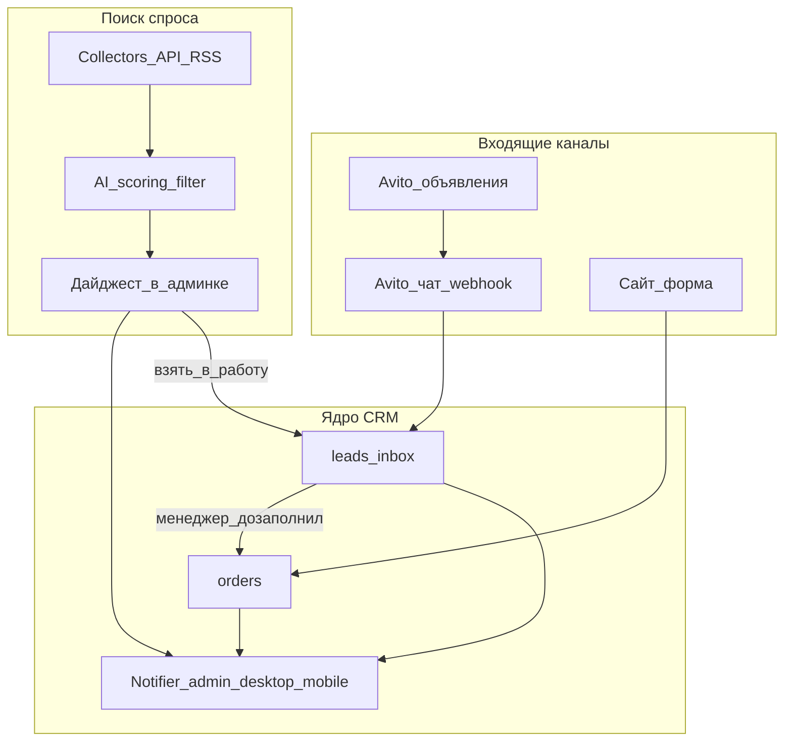
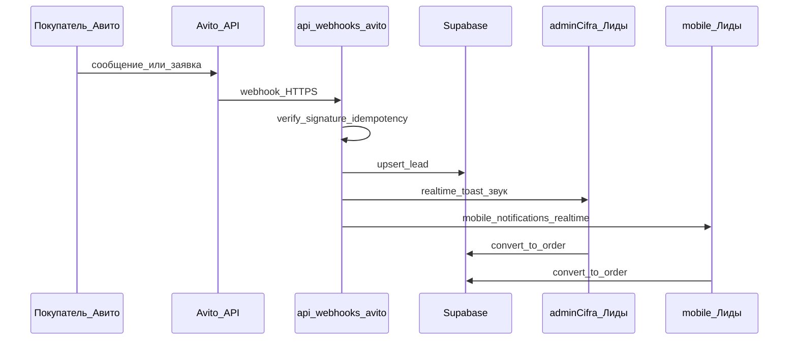
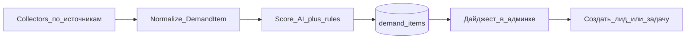

# План интеграции с Авито и поиска спроса на бетон

## Контекст текущей системы

Сейчас в [concrete-beton-app](/Users/gudman/concrete-beton-app):

- Заявка = сразу запись в `orders` через [`POST /api/order`](app/api/order/route.ts) (марка, объём, дата, адрес обязательны).
- В коде ещё есть алерты в Max — **в этом плане их не используем и не развиваем**. Канал работы менеджеров: только **adminCifra (десктоп)** и **mobile-админка** (realtime, toast/звук, `admin_notifications` / `mobile_notifications`).
- Поля `lead_source` / `external_id` / сырого payload от площадок **нет**.
- Внешних маркетплейсов нет — это плюс: можно заложить чистую архитектуру каналов.

**Ключевой вывод:** Авито почти всегда даёт «сырой» контакт (телефон/чат + текст), а не полный заказ. Пихать это напрямую в текущий `/api/order` нельзя — нужна промежуточная сущность **лид**.

---

## Целевая картина (что получите)

Три связанных продукта в десктопной и мобильной админке:

1. **Канал продаж «Авито»** — управление своими объявлениями + мгновенные заявки/сообщения менеджерам в админке.
2. **Единый inbox лидов** — Avito, сайт, позже другие площадки → одна очередь → менеджер конвертирует в заказ.
3. **Ассистент спроса** — ежедневный/realtime поиск «куплю бетон / тендеры / запросы» по региону доставки, скоринг и алерты в админке.



---

## Рекомендуемая стратегия (мои приоритеты)

| Приоритет | Зачем | Ожидаемый эффект |
|-----------|--------|------------------|
| **P0 — Inbox лидов + webhook Авито (чат)** | Не терять горячие обращения | Рост конверсии входящих за 2–4 недели |
| **P1 — Уведомления и SLA в админке** | Скорость ответа критична на Авито | Ответ < 5 мин → выше рейтинг и выдача |
| **P2 — Управление объявлениями** | Единый шаблон цен/остатков/зон доставки | Меньше ручной работы, актуальные цены |
| **P3 — Ассистент спроса (тендеры + «куплю»)** | Новый поток B2B/крупных объёмов | Долгий цикл, но крупные контракты |

**Не начинать** с «умного парсера всего интернета». Сначала закрыть входящий канал Авито официальным API — это легально, стабильно и сразу деньги.

---

## Фаза 0. Фундамент в вашем приложении (1–1.5 недели)

Без этого любая площадка будет костылём.

### Модель данных

Новая таблица `leads` (или `inbound_leads`):

- `id`, `source` (`avito` | `site` | `tender` | `manual` | …)
- `external_id` + unique `(source, external_id)` — идемпотентность webhook
- `status`: `new` → `in_progress` → `converted` | `rejected` | `spam`
- контакты: phone, name, chat_url
- `raw_text`, `raw_payload` (jsonb)
- извлечённые поля (nullable): grade, volume_m3, address, city, desired_date
- `score` (0–100), `assigned_to`, `order_id` (после конверсии)
- timestamps + `notified_at`

Расширение `orders`:

- `lead_id`, `lead_source`, `external_ref` — атрибуция канала в отчётах.

### Единый Notifier (только админка)

Сервис `notifyManagers({ type, title, body, link })` пишет в каналы, которыми менеджеры реально пользуются:

- **Supabase Realtime** → toast + звук в [`adminCifra`](app/adminCifra/layout.tsx) (как сейчас для заявок через [`useRealtimeOrders`](hooks/useRealtimeOrders.ts))
- **`admin_notifications`** — колокольчик / лента на десктопе
- **`mobile_notifications`** — колокольчик и пуш-ready поток в mobile-админке
- Browser Notification на mobile/desktop (пока вкладка открыта; Web Push — отдельным шагом при необходимости)

**Max и Telegram в схему уведомлений не входят.**

Правило: **любой новый лид всегда алертит** в обеих админках; заказы, созданные вручную из админки (`source: admin`), остаются «тихими».

### UI: десктоп + mobile

Раздел **«Лиды»**:

- десктоп: рядом с [`zayavki`](app/adminCifra/zayavki/page.tsx)
- mobile: зеркальный раздел в `/mobile/*` с той же логикой

Функции:

- список new / фильтр по source
- карточка: текст, телефон, кнопка «Создать заказ» (предзаполнение `NewOrderModal` / mobile-аналога)
- кнопка «Открыть чат на Авито»

---

## Фаза 1. Авито: входящие заявки и чаты (2–3 недели) — максимальный ROI

### Что использовать

Официальный [Avito Business API](https://developers.avito.ru/api-catalog):

- OAuth2 (`client_id` / `client_secret` из кабинета продавца)
- **Messenger API** + **webhook** на новые сообщения
- Items API — статусы объявлений (для фазы 2)

Важно: доступ к мессенджеру у Авито часто требует **платной подписки / проф. тарифа**. Заложить это в бюджет до разработки.

### Поток



### Технически в вашем репо

- `POST /api/webhooks/avito` — **отдельный** guard (секрет webhook / signature), не `x-user-id`
- `lib/integrations/avito/` — auth token cache (24h), client, normalize message → lead
- Vercel cron (у вас уже есть cron) — polling чатов как fallback, если webhook протух
- Автоответ на Авито (опционально, осторожно): короткий шаблон «Приняли запрос, менеджер ответит за N минут» — только если политика компании ок; иначе только алерт в админке

### Правила квалификации лида (простое правило + LLM)

1. Эвристики: телефон, ключевые слова (бетон, м³, марка М/В, доставка, адрес).
2. LLM (дешёвая модель) → JSON: `{intent, grade?, volume?, city?, urgency}`.
3. Если `intent=spam` или не про бетон → `spam`, без алерта (или в тихий лог).
4. Если похоже на заказ → `new` + realtime/уведомление в adminCifra и mobile.

### KPI фазы 1

- время до первого ответа менеджера
- % лидов → заказ
- % дублей (должен быть ~0 за счёт `external_id`)

---

## Фаза 2. Управление объявлениями на Авито (2–4 недели)

Цель: менеджер не заходит в кабинет Авито каждый день.

### Возможности модуля «Площадки → Объявления»

- Синхронизация списка объявлений (статус, просмотры, контакты)
- Шаблоны описаний из ваших марок/цен ([`lib/config/concrete.ts`](lib/config/concrete.ts))
- Обновление цены/наличия/зоны доставки одним действием
- Алерты в админке: объявление снято модерацией, баланс на нуле, рейтинг упал
- Автозагрузка (если используете XML/фид Авито) — удобнее для массового обновления прайса

### Рекомендация по контенту объявлений

- Отдельные объявления по **маркам** или по **услуге «бетон с доставкой + насос»**, а не одно «всё подряд»
- В тексте: зона доставки, минимальный объём, время подачи, что входит в цену
- UTM/метки в тексте или разные объявления → чтобы в аналитике видеть, какое объявление даёт заказы (через `external_ref` объявления в лиде)

### Чего не делать

- Не строить полноценный «редактор Авито» в первой версии — хватит sync + шаблоны + кнопки «обновить цену / активировать / пауза».
- Не дублировать весь кабинет Авито — только операционные действия менеджера.

---

## Фаза 3. Интеллектуальный помощник поиска спроса (3–6 недель, итерациями)

Это отдельный продукт: **Demand Radar**.

### Источники (в порядке «легальность / ценность»)

| Источник | Тип спроса | Как брать данные | Приоритет |
|----------|------------|------------------|-----------|
| Госзакупки / агрегаторы (Контур.Закупки, СБИС, РосТендер и т.п.) | Крупный B2B | Официальные API/подписки | Высокий |
| `zakupki.gov.ru` + коммерческие ЭТП | Тендеры | API/выгрузки агрегаторов | Высокий |
| Авито: объявления «куплю бетон / ищу поставщика» | Мелкий/средний B2C–B2B | Только в рамках правил API/кабинета; **не** серый скрапинг | Средний |
| Telegram-каналы/чаты строек региона | Быстрый спрос | Бот с доступом в разрешённые чаты | Средний |
| ЦИАН/строительные форумы | Слабый сигнал | Низкий приоритет | Низкий |

**Жёсткая рекомендация:** не строить «парсер Авито поиска» в обход ToS. Риск бана аккаунта и юридических претензий выше выгоды. Для Авито — официальный API своего кабинета + входящие; для спроса снаружи — тендеры и разрешённые каналы.

### Архитектура Demand Radar



Таблица `demand_items`:

- source, external_url, title, body, region, published_at
- extracted: volume, grades[], delivery_needed, buyer_type
- `fit_score` — насколько подходит **вашему** заводу (радиус доставки, мин. объём, загрузка БСУ)
- status: `new` | `relevant` | `ignored` | `taken`

### «Интеллект» — что реально нужно, а что хайп

**Нужно:**

1. Фильтры региона и радиуса доставки (геокод у вас уже есть — DaData/гео).
2. Извлечение сущностей из текста (марка, м³, адрес, срок).
3. Скоринг fit: расстояние × объём × марка в прайсе × срочность.
4. Дедуп (один тендер с 5 площадок).
5. Утренний дайджест в разделе «Спрос» (desktop + mobile) + realtime-тост при `fit_score >= threshold`.

**Не нужно в v1:**

- Автоответы на тендеры без человека.
- Автоматическая подача КП.
- «Агент, который сам торгуется».

Человек всегда в контуре решения; AI только **находит и приоритизирует**.

### UI

Раздел **«Спрос»** в adminCifra и mobile:

- лента с score
- фильтры: регион, мин. м³, источник
- «Взять» → создать `lead` + задачу менеджеру
- «Не интересно» → обучение фильтра (простые правила / negative keywords)

---

## Фаза 4. Масштабирование на другие площадки (после стабилизации Авито)

Паттерн **Adapter**:

```ts
interface MarketplaceAdapter {
  source: string
  fetchListings?()
  handleWebhook?(req)
  publishOrUpdate?(payload)
  normalizeLead?(raw): LeadDraft
}
```

Кандидаты после Авито: Юла (если жива в регионе), профильные строительные доски объявлений региона, B2B-площадки, Telegram-чаты строек (как источник спроса, не как мессенджер для менеджеров).

Каждая новая площадка = новый adapter + credentials, без переписывания inbox.

---

## Оргпроцесс и SLA (без этого интеграция бесполезна)

1. **Дежурный менеджер** на входящие Авито (ротация в `adminCifra` / mobile).
2. SLA: первый ответ **≤ 5 минут** в рабочее время; вне часов — автоответ на Авито + эскалация утром в админке.
3. Скрипт ответа: уточнить марку, объём, адрес, дату/время, насос.
4. Конверсия лид → заказ только после минимального набора полей (как в текущей форме).
5. Еженедельный отчёт: лиды по источникам, конверсия, средний чек, время ответа.

---

## Оценка сроков и бюджета (ориентир)

| Этап | Срок разработки | Внешние затраты |
|------|-----------------|-----------------|
| Фаза 0 — leads + notifier admin/mobile | 1–1.5 нед | — |
| Фаза 1 — Avito webhook/чаты | 2–3 нед | тариф Авито API/Messenger |
| Фаза 2 — объявления | 2–4 нед | — |
| Фаза 3 — Demand Radar v1 (тендеры) | 3–6 нед | подписка агрегатора тендеров + LLM API |
| Фаза 4 — новые площадки | по 1–2 нед на адаптер | по площадке |

Первый ощутимый бизнес-результат — **конец фазы 1**.

---

## Риски и как закрывать

| Риск | Митигация |
|------|-----------|
| Неполный лид ≠ заказ | Таблица `leads`, конверсия вручную |
| Дубли webhook | unique `(source, external_id)` |
| Бан за скрапинг | Только официальные API / платные легальные агрегаторы |
| Менеджеры не успевают | SLA + дежурство + громкий toast/звук в desktop и mobile |
| Платный Messenger API Авито | Проверить тариф **до** кода |
| Мусорный спрос из тендеров | fit_score + георадиус + мин. объём |
| Утечка токенов | env на Vercel, webhook secret, отдельный сервисный аккаунт Авито |

---

## Что сделать прямо сейчас (до разработки)

1. Завести приложение в кабинете Авито → получить `client_id` / `client_secret`, проверить доступ к Messenger и Items.
2. Зафиксировать географию работы и мин. объём поставки — это ядро скоринга.
3. Выбрать 1 агрегатор тендеров под ваш регион (на месяц пилот).
4. Назначить ответственного менеджера за канал Авито (desktop + mobile под рукой).
5. После этого — реализация фазы 0→1 в коде.

---

## Рекомендация «как делать у вас»

Идти по пути **Inbox-first**:

1. `leads` + единый notifier **только в adminCifra и mobile** (realtime + колокольчики).
2. Avito webhook → лиды → конверсия в существующие `orders` / `zayavki` (и mobile-аналоги).
3. Потом панель объявлений.
4. Demand Radar сначала на **тендерах региона**, не на сером парсинге «куплю» по всему Авито.

Так вы не ломаете текущий производственный контур (рейсы, БСУ, склад), но получаете новый коммерческий слой поверх уже рабочей операционки — без зависимости от мессенджера Max.

---

## Как получить API Авито (подробная инструкция)

Официальный каталог: [developers.avito.ru/api-catalog](https://developers.avito.ru/api-catalog)

Переменные приложения (см. также `scripts/leads-marketplace-env.example`):

| Переменная | Откуда |
|------------|--------|
| `AVITO_CLIENT_ID` | Кабинет разработчика → приложение |
| `AVITO_CLIENT_SECRET` | Там же (показать/скопировать один раз) |
| `AVITO_USER_ID` | Числовой id аккаунта продавца |
| `AVITO_WEBHOOK_SECRET` | Сами генерируем длинную строку (**обязательна**, без неё webhook → 401) |
| `CRON_SECRET` | Для cron `avito-sync` / `demand-radar` на Vercel |

### Шаг 1. Аккаунт продавца

1. Войти в Авито под аккаунтом, **где висят объявления о бетоне**.
2. Нужен **профессиональный / бизнес** кабинет.
3. В тарифах Pro проверить доступ к **API мессенджера**. Без нужной подписки объявления (Items) иногда доступны, а чаты/webhook могут отвечать `402`.

### Шаг 2. Регистрация приложения (ключи)

1. Открыть [developers.avito.ru](https://developers.avito.ru) тем же продавцом.
2. Раздел «Приложения» / в ЛК: **Настройки → Avito API → Регистрация приложения**.
3. Создать приложение (название вроде `Concrete Beton CRM`).
4. Права (scopes), минимум: `messenger:read`, при необходимости `messenger:write`, доступ к объявлениям/items.
5. Сохранить **Client ID** → `AVITO_CLIENT_ID`, **Client Secret** → `AVITO_CLIENT_SECRET` (не в git).

### Шаг 3. Узнать `AVITO_USER_ID`

Числовой id пользователя Авито (не телефон). Проверка токена:

```bash
curl -s -X POST "https://api.avito.ru/token" \
  -H "Content-Type: application/x-www-form-urlencoded" \
  -d "grant_type=client_credentials&client_id=…&client_secret=…"
```

Дальше запросы с `Authorization: Bearer <access_token>`. User id подставить в `AVITO_USER_ID`.

### Шаг 4. Секрет webhook (наш)

```bash
openssl rand -hex 32
```

Положить в `AVITO_WEBHOOK_SECRET`. URL после деплоя:

```text
https://ТВОЙ-ДОМЕН/api/webhooks/avito?secret=ТВОЙ_AVITO_WEBHOOK_SECRET
```

Либо заголовок `x-avito-webhook-secret` / `Authorization: Bearer …`.

### Шаг 5. Подписка webhook в Авито

В каталоге API → Messenger → subscribe webhook на URL выше. Пока нет прод-URL — работает polling cron `/api/cron/avito-sync` (нужен `CRON_SECRET`).

### Шаг 6. Env у нас

Локально `.env.local`, прод — Vercel Environment Variables, затем redeploy.

Проверка:

```bash
curl "https://ТВОЙ-ДОМЕН/api/webhooks/avito?secret=…"
# → ok: true, webhookSecretConfigured: true
```

В админке: **Площадки** → «Синхронизировать Авито». Тестовое сообщение в чат объявления → лид в `/adminCifra/leads`.

### Типичные ошибки

| Симптом | Причина |
|---------|---------|
| `401` на webhook | Нет/неверный `AVITO_WEBHOOK_SECRET` |
| `402` на чатах | Нет платной подписки API мессенджера |
| `401` на token | Неверный client_id/secret |
| Пустые чаты, объявления ок | Нет messenger scope / неверный `AVITO_USER_ID` |
| Cron `401` | Не задан `CRON_SECRET` в Vercel |

### Чеклист

1. Бизнес-аккаунт + тариф с API мессенджера.
2. Создать приложение → Client ID / Secret.
3. Узнать User ID → `AVITO_USER_ID`.
4. Сгенерировать `AVITO_WEBHOOK_SECRET` + `CRON_SECRET`.
5. Задеплоить с env.
6. Подписать webhook.
7. Тест: сообщение → лид в админке.

---

## Как подключить поиск спроса: госзакупки (пункты 1–2 таблицы)

Два верхних источника Demand Radar с **высоким приоритетом**:

1. Агрегаторы (Контур.Закупки, СБИС/Saby, РосТендер и т.п.).
2. ЕИС `zakupki.gov.ru` + коммерческие ЭТП.

В приложении сейчас: коллектор `DEMAND_FEED_URL` → JSON → `demand_items` → скоринг → раздел **Спрос**.

Формат элемента ленты:

```json
{
  "id": "44-0123456789",
  "title": "Поставка товарного бетона М300",
  "body": "Объём 120 м³, доставка…",
  "url": "https://…",
  "region": "Брянская область",
  "published_at": "2026-07-26T08:00:00Z"
}
```

Env: `DEMAND_FEED_URL`, `DEMAND_HOME_REGIONS`, `DEMAND_MIN_VOLUME_M3`, `DEMAND_ALERT_SCORE`.  
`DEMAND_DEMO=1` только локально/preview (на Vercel production игнорируется).

### Стратегия

- **Старт:** один агрегатор (Контур или Saby) → JSON → `DEMAND_FEED_URL`.
- **ЕИС напрямую** — только если агрегатор режет нужные закупки или слишком дорог (SOAP, токен, часто ГОСТ/КриптоПро, отдельный VPS; на чистом Vercel тяжело).
- Коммерческие ЭТП по одной не подключать в v1 — часть уже внутри агрегатора.

---

### 1. Агрегаторы (рекомендуемый путь)

#### A. Контур.Закупки

Сайт: [zakupki.kontur.ru](https://zakupki.kontur.ru), цены: [zakupki.kontur.ru/price](https://zakupki.kontur.ru/price).

1. Веб-тариф Стандарт / Эксперт / Командный + пробный доступ.
2. Вручную фильтр: Брянская обл. (+ зона доставки), слова `бетон`, `бетонная смесь`, `раствор`, `БСТ`, 44-ФЗ + 223-ФЗ, ОКПД2 при необходимости.
3. Неделя глазами — отсечь мусор («бетонолом», урны).
4. Заявка на **модуль API для CRM** (часто пакеты «Поиск» + «Получение полной информации»; контакт вроде `zakupki.api@skbkontur.ru`).
5. Получить ключ, доки, лимиты.
6. Воркер (cron / n8n / отдельный скрипт): API → маппинг в JSON выше → HTTPS URL.
7. В Vercel / `.env.local`: `DEMAND_FEED_URL=…`.
8. Админка **Спрос** → «Запустить поиск» или cron `/api/cron/demand-radar`.

Пилот без API: Excel из Контура → конвертер в JSON раз в день, потом заменить на API.

#### B. Saby (СБИС) «Торги и закупки»

Дока: [saby.ru/help/auction/api](https://saby.ru/help/auction/api).

1. Регистрация [online.sbis.ru](https://online.sbis.ru).
2. Тариф Торги + опция «Работа через API».
3. Подборка/папка с фильтрами (бетон, регион).
4. Auth → SID; методы вроде `GetTenderListFromFolder`, избранное, обновления по ID.
5. Маппинг → тот же JSON → `DEMAND_FEED_URL`.

#### C. РосТендер и аналоги

Та же схема: тариф с API/выгрузкой → фильтр → JSON → `DEMAND_FEED_URL`. Если только Excel/почта — пилот через ежедневную конвертацию.

#### Выбор для завода (Брянск)

| Критерий | Рекомендация |
|----------|----------------|
| Быстрый старт 1–2 нед | Контур или Saby с пробником |
| Без ГОСТ на сервере | Только агрегатор |
| Бюджет пилота | 1 веб-тариф + API на месяц, жёсткий геофильтр |

---

### 2. ЕИС zakupki.gov.ru (+ коммерческие ЭТП)

Официальный источник 44-ФЗ / 223-ФЗ. Мощно, но тяжело для стека Vercel.

Факты:

- FTP ЕИС закрыт; работают сервисы отдачи (SOAP/XML).
- Нужен токен в ЛК ЕИС (машиночитаемые данные / сервисы отдачи; актуальный путь смотреть в ЛК, ориентир PMD auth).
- С 2025 чаще нужны новые домены (`int.zakupki.gov.ru` и др.) и иногда ГОСТ/КриптоПро.
- Данные — архивы XML → свой парсер, фильтр, дедуп.
- На чистом Vercel serverless почти не взлетает без внешнего ВМ/прокси с КриптоПро.

Если идти напрямую:

1. ЛК ЕИС → токен сервиса отдачи.
2. Отдельная машина (не Vercel): КриптоПро/сертификаты по инструкции ЕИС.
3. Воркер: SOAP `getDocsIP` (актуальный WSDL/base URL из доки ЕИС) → XML → фильтр бетон/регион → JSON.
4. Снова только `DEMAND_FEED_URL` в приложении.

Коммерческие ЭТП (B2B-Center и т.п.) — по ЛК каждой площадки; в v1 не приоритет, часть уже в агрегаторе.

---

### Сводка двух пунктов плана

| Пункт | Как подключать | Сложность | Пилот |
|-------|----------------|-----------|--------|
| 1. Агрегаторы | Контур/Saby → API/папка → JSON → `DEMAND_FEED_URL` | Средняя | 1–3 нед |
| 2. ЕИС + ЭТП | Через агрегатор **или** токен ЕИС + SOAP + ГОСТ на VPS | Высокая | 1–2+ мес |

### Чеклист пилота спроса

1. Пробник Контур или Saby.
2. Фильтр: Брянская обл. + бетон/раствор/БСТ.
3. Неделя ручной оценки % мусора.
4. Запросить API / выгрузку.
5. Экспорт в JSON под `DEMAND_FEED_URL`.
6. Включить **Спрос**, смотреть `fit_score` и алерты.
7. Прямую ЕИС — только если агрегатор не закрыл потребность.
