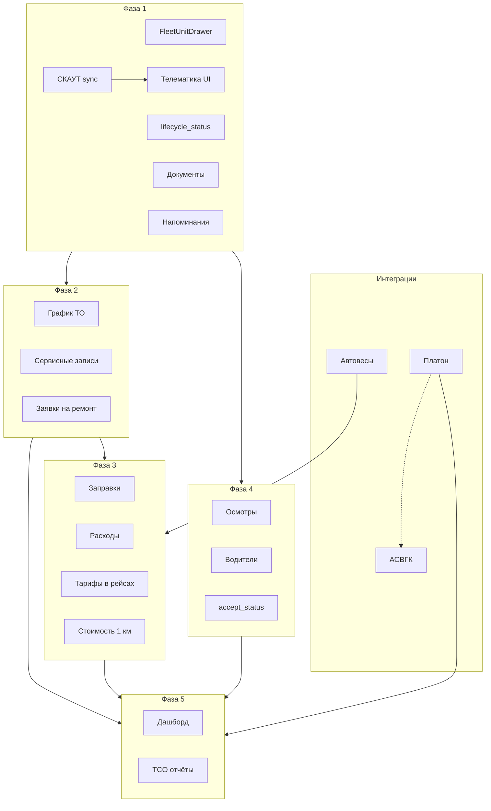

# План: Развитие раздела «Техника» (FMS)

## Статус: Фазы 1–3 и 5 в коде (Фаза 4 — осмотры/водители ещё нет)

Дата фиксации: 03.08.2026 · Фаза 2: 05.08.2026 · Фаза 3: 05.08.2026 · Фаза 5: 06.08.2026  

Источник анализа: [Завгар Онлайн](https://zavgar.online/), [документация модуля «Автопарк»](https://docs.zavgar.online/ru/wiki/fleet-control-system/)

---

## Контекст

Раздел **Техника** (`/adminCifra/mixers`) уже эволюционировал из «Миксеров» в справочник автопарка (6 видов техники, сцепки, тарифы, история рейсов миксеров, мобильное приложение водителя).

**Завгар Онлайн** — универсальная FMS: учёт затрат, ТО, топливо, осмотры, путевые листы, GPS, штрафы, склад запчастей, стоимость 1 км.

**Стратегия:** не копировать Завгар целиком, а добавить слой **эксплуатации и TCO** поверх существующей **операционной логистики бетона** (рейсы ↔ заявки, планировщик, простой, Realtime).

### Конкурентное преимущество (уже есть)

| | Завгар | Мы |
|---|---|---|
| Рейсы ↔ заявки | Путевые листы отдельно | Рейс = часть заявки на бетон |
| Статусы в реальном времени | Через GPS | Водительское приложение + Realtime |
| Планировщик | Нет | `logisticsPlanner` |
| Простой на объекте | Нет | `downtime_minutes` |
| Сцепки голова ↔ прицеп | Нет | `fleet_couples` |
| Тарифы доставки бетона | Нет | `delivery_settings` |
| Bulk-логистика | Нет | Частично (`order_type=bulk`) |

---

## Текущее состояние (baseline)

### ✅ Реализовано

- Справочник 6 видов техники (desktop + mobile)
- CRUD, шаблоны моделей, specs по виду
- Свои / наёмные (`type: own | rented`), норма разгрузки
- Сцепки `fleet_couples` + назначение в bulk-заявках
- Тарифы non-mixer в `specs` + массовое редактирование в Settings
- Тарифы доставки бетона (`DeliverySettingsTab`)
- Статусы миксеров из активных рейсов (`active-mixers`)
- История рейсов миксера (`MixerHistoryDrawer`)
- Доп. водители (`mixer_drivers`) + авторизация в mobile
- Интеграция с заявками, оператором, планировщиком

### 🟡 Частично

- Тарифы в рейсах — хранятся, расчёт «этап 2» не завершён
- Bulk-логистика — слабее бетонного контура
- Статусы non-mixer — справочный `status`, без жизненного цикла
- Поле `location` в типе — не используется

### ❌ Нет

- ТО / ремонт / сервисная история
- Топливо / ГСМ / доп. расходы
- Одометр / моточасы
- Предрейсовые осмотры
- Документы на ТС (СТС, ОСАГО, техосмотр)
- Справочник водителей с историей назначений
- Стоимость 1 км / TCO
- GPS, топливные карты, штрафы
- UI удаления техники (API есть)

### Связанные планы

- [`свои_vs_наёмные_миксеры.plan.md`](свои_vs_наёмные_миксеры.plan.md) — `accept_status`, кнопки Взять/Отказаться (отложено)
- [`интеллект_планирования_логистики.plan.md`](интеллект_планирования_логистики.plan.md) — планировщик; Фаза 2 блокировка ТС на ремонте должна учитываться в `rankFleetForDay`

---

## Сопоставление модулей: Завгар ↔ наша система

| Модуль Завгара | Наш аналог / цель |
|---|---|
| Список ТС / карточка | `/adminCifra/mixers` → drawer «Карточка ТС 2.0» |
| Статусы ТС | `lifecycle_status` + операционные из рейсов |
| Типы / группы | `vehicle_kind` (уже есть) |
| Электронная сервисная книга | Вкладки: Рейсы, Сервис, Топливо, Документы |
| Назначения водителей | Справочник `drivers` + история |
| Топливо | `fuel_entries` |
| Сервис / заказ-наряды | `fleet_service_records` |
| Осмотры | `fleet_inspections` + шаблоны |
| Доп. расходы | `fleet_expenses` |
| Напоминания | `fleet_reminders` |
| Стоимость 1 км | Агрегация из рейсов + затрат |
| GPS / телематика | **Фаза 1** — СКАУТ СПИК (INT-2) |
| Путевые листы | Рейсы `order_mixers` (своя модель, не дублировать) |

---

## Архитектура UI

```
/adminCifra/mixers              — список (как сейчас, вкладки по vehicle_kind)
  └── клик по единице → FleetUnitDrawer (новый компонент)
        ├── Паспорт      — VIN, год, фото, одометр, lifecycle_status
        ├── Рейсы        — FleetHistoryDrawer (расширение MixerHistoryDrawer)
        ├── Сервис       — Фаза 2
        ├── Топливо      — Фаза 3
        ├── Расходы      — Фаза 3
        ├── Документы    — Фаза 1
        ├── Телематика   — Фаза 1 (СКАУТ: карта, скорость, online/offline)
        ├── Осмотры      — Фаза 4
        └── Интеграции   — Платон, автовесы (Фаза 1+: СКАУТ уже в «Телематика»)
```

**Решение v1:** drawer (как `MixerHistoryDrawer`), без отдельного URL `/mixers/[id]` — меньше рефакторинга.

**Ключевые файлы (существующие):**

- [`app/adminCifra/mixers/page.tsx`](app/adminCifra/mixers/page.tsx)
- [`app/adminCifra/mixers/MixerHistoryDrawer.tsx`](app/adminCifra/mixers/MixerHistoryDrawer.tsx)
- [`lib/fleetCatalog.ts`](lib/fleetCatalog.ts)
- [`lib/fleetTariffs.ts`](lib/fleetTariffs.ts)
- [`app/mobile/mixers/page.tsx`](app/mobile/mixers/page.tsx)
- [`app/mobile/driver/`](app/mobile/driver/)

---

## Фаза 1 — Карточка ТС 2.0 + СКАУТ (3–4 недели)

**Цель:** электронная сервисная книга **и** живая телематика из СКАУТ — фундамент для всех следующих модулей.

| Задача | Детали |
|---|---|
| `FleetUnitDrawer` | Боковая панель по клику на карточку; вкладки Паспорт / Рейсы / Документы / **Телематика** |
| Паспорт | VIN, год выпуска, фото, одометр (`odometer_km`), моточасы (`engine_hours`), тип топлива, объём бака → `specs` или колонки |
| `lifecycle_status` | `active` \| `repair` \| `conservation` \| `sold` \| `rented_out` — отдельно от операционного статуса рейса |
| Документы | Таблица `fleet_documents`: type (sts, osago, inspection, lease), file_url, expires_at; upload в Supabase Storage |
| Напоминания | `fleet_reminders`: kind, due_date, due_odometer, status; badge на карточке «ОСАГО через 14 дн.» |
| Удаление UI | Кнопка + confirm → `DELETE /api/adminCifra/mixers?id=` |
| История всех видов | `FleetHistoryDrawer` — не только `mixer`, но dump_truck, tonar и т.д. (где есть привязка к рейсам) |
| **СКАУТ — client** | `lib/integrations/scout/client.ts`: Login → SessionId, `getAllUnitsPaged`, Subscribe + GetOnlineData |
| **СКАУТ — sync** | Vercel Cron каждые **2 мин** (`*/2`) → `fleet_telemetry_snapshots`; env: `SCOUT_SERVER_URL`, `SCOUT_LOGIN`, `SCOUT_PASSWORD` |
| **СКАУТ — маппинг** | Колонка `mixers.scout_unit_id`; первичная привязка по `Name` (СКАУТ) ≈ `mixers.number`; UI ручной override |
| **СКАУТ — UI** | Badge 🟢/🔴 в списке техники; вкладка «Телематика»: lat/lon, скорость, адрес, время последнего сигнала, мини-карта |
| **СКАУТ — история поездок** | Трек на карте за период (день/смена): предпочтительно из СПИК; локальный trail как запасной слой — см. ниже |

### СКАУТ — проверенное подключение (04.08.2026)

| Параметр | Значение |
|---|---|
| BaseAddress | `http://724033.ru:8081` |
| Пользователь API | Трейдком (UserId: 502) |
| Объектов в СКАУТ | **13** (2490 ЕМ 32, 3310 ЕМ 32, 4323ЕН, К 332 КК, Н 627 УТ, О 011 ЕВ, О 021 УХ, О 157 РС, О 262 УА, О 270/271 УН, О 285 ЕХ, Р 961 АК) |
| Login | ✅ `IsAuthenticated: true` |
| OnlineData | ✅ Subscribe с `UnitIds` → координаты, скорость, адрес |
| Offline | 3310 ЕМ 32 — последний сигнал 22.06.2026 (алерт в UI) |

### СКАУТ — справочник UnitId и ручная привязка

Если машина уже есть в adminCifra, но номер записан иначе, чем `Name` в СКАУТ — автопривязка не сработает.

**Вариант B — ручная привязка**

1. Открой **Карточка** → вкладка **Паспорт**
2. Поле **СКАУТ UnitId** (например `3741` для «О 021 УХ»)
3. **Сохранить паспорт** → sync подтянет телематику (автосинк после сохранения или кнопка «↻ Обновить GPS»)

**UnitId из СКАУТ** (13 объектов на мониторинге):

| UnitId | Название (СКАУТ) |
|--------|------------------|
| 2463 | 2490 ЕМ 32 |
| 2602 | 3310 ЕМ 32 |
| 3365 | 4323ЕН |
| 3921 | К 332 КК |
| 2855 | Н 627 УТ |
| 3437 | О 011 ЕВ |
| 3741 | О 021 УХ |
| 3234 | О 157 РС |
| 3617 | О 262 УА |
| 3674 | О 270 УН |
| 3675 | О 271 УН |
| 3649 | О 285 ЕХ |
| 3743 | Р 961 АК |

**MVP Фазы 1 (online + история поездок):**
1. Последняя точка: lat, lon, speed, `last_message_at`, адрес
2. Статус online/offline (>15 мин без данных)
3. Badge в списке mixers
4. **История поездок** — линия маршрута на карте за выбранный период (день / смена / произвольный from–to)

**Отложено на Фазу 3 (из INT-2 v2):**
- Одометр из `StatisticsController` → автообновление `odometer_km`
- Топливо из `FuelEvent` / датчиков → `fuel_entries`
- ETA в планировщике

### СКАУТ — история поездок (Фаза 1, добавлено 05.08.2026)

#### 1) Можно ли забирать историю из СКАУТ?

**Да.** OnlineData даёт только «сейчас»; история — через другие сервисы СПИК (и опционально TrackService).

| Источник | Что даёт | Статус у нас |
|---|---|---|
| `OnlineDataService` | Только текущая точка | ✅ уже используем |
| **`SpicTrackPeriodsStatisticsService`** (`/spic/TrackPeriod/rest/…`) | Статистика / точки трека за период | ✅ endpoint на `724033.ru:8081` отвечает **401 без токена** (= сервис жив) |
| **`SpicTrackPeriodsMileageStatisticsService`** (`/spic/trackPeriodsMileage/rest/…`) | Пробег по периодам | ✅ тоже 401 без токена |
| `SpicReportsService` (`reports`) | Отчёты движения/стоянок | в документации СПИК |
| **TrackService** (отдельная SOAP-служба, часто порт 6667) | Готовый трек / набор точек / отчёт стоянок за период; «не храня точки в учётке» | Нужна установка/доступ у интегратора — **не обязателен**, если хватит TrackPeriod в СПИК |

**Вывод по п.1:** забирать историю из СКАУТ **можно и предпочтительно**. Следующий шаг реализации — Login → вызов методов TrackPeriod / trackPeriodsMileage (по доке СПИК / локальной «Документации СПИК») → отрисовка polyline. Если метод окажется «статистика без сырых точек» — смотреть NavigationFiltration / reports или запросить у ТП пакет TrackService.

#### 2) Писать трек у себя (каждые N минут)

**Да, как запасной слой и кэш для UI.**

Идея: при каждом уже существующем scout-sync (раз в **2 мин**) дописывать точку в `fleet_telemetry_points`, если координаты валидны и машина online (или сдвинулась >X метров). UI: выбор периода → polyline из своей таблицы; при наличии СПИК-трека — приоритет у СКАУТ, локальный trail как fallback / быстрый превью.

```sql
-- дополнение к scripts/fleet-lifecycle.sql (или отдельный scripts/fleet-telemetry-points.sql)
CREATE TABLE IF NOT EXISTS fleet_telemetry_points (
  id BIGSERIAL PRIMARY KEY,
  mixer_id BIGINT NOT NULL REFERENCES mixers(id) ON DELETE CASCADE,
  scout_unit_id INT,
  lat NUMERIC NOT NULL,
  lon NUMERIC NOT NULL,
  speed_kmh NUMERIC,
  recorded_at TIMESTAMPTZ NOT NULL,
  source TEXT NOT NULL DEFAULT 'scout_sync', -- scout_sync | scout_track_api
  created_at TIMESTAMPTZ NOT NULL DEFAULT now()
);
CREATE INDEX IF NOT EXISTS fleet_telemetry_points_mixer_time_idx
  on fleet_telemetry_points (mixer_id, recorded_at DESC);
-- RLS deny-all как у остальных fleet_* таблиц
```

**Retention:** cron/SQL job раз в сутки — `DELETE WHERE recorded_at < now() - interval '90 days'` (настраиваемо 30/90).

#### 3) Нагрузка и объём — забьёт ли хранилище?

Оценка для парка **~5–13 ТС**, sync **каждые 2 мин**, смена ~**10 ч/сутки**, строка ~**100–200 байт** с индексами:

| Сценарий | Точек / сутки | Точек / 90 дней | Объём ~90 дней |
|---|---:|---:|---:|
| 5 машин, 2 мин | ~1 500 | ~135 000 | **~15–30 МБ** |
| 13 машин, 2 мин | ~3 900 | ~350 000 | **~40–70 МБ** |
| 13 машин, 1 мин | ~7 800 | ~700 000 | **~80–140 МБ** |

Нагрузка на сервер: **+0** отдельных cron — пишем в том же scout-sync (один upsert snapshot + batch insert points). Запрос трека за день: `WHERE mixer_id=? AND recorded_at BETWEEN …` по индексу — тысячи точек, для Leaflet нормально; при необходимости прореживание (каждая N-я / Douglas-Peucker).

**Вывод по хранилищу:** при retention **90 дней** объём **десятки МБ**, не гигабайты. Supabase / локальный Postgres **не забьёт**. Без retention за год при 13 ТС — порядка сотен МБ (всё ещё терпимо, но retention обязателен в DoD).

#### Рекомендуемая схема реализации (Фаза 1)

1. **A (основной путь):** по запросу UI → API → СПИК `TrackPeriod` / аналог → polyline (история хранится у СКАУТ, у нас только кэш ответа на сессию опционально).
2. **B (всегда включён тонкий trail):** при sync писать точку в `fleet_telemetry_points` + retention 90 дней.
3. UI: вкладка Телематика / модалка карты — переключатель «Сейчас» / «За день» / период; линия маршрута + маркеры старт/финиш.
4. Sync истории с Vercel по-прежнему упирается в доступность `724033.ru:8081` из облака — **запись trail и запросы TrackPeriod надёжнее с Mac mini / localCron** (как текущий GPS sync).

### Схема БД — Фаза 1

```sql
-- scripts/fleet-lifecycle.sql

ALTER TABLE mixers
  ADD COLUMN IF NOT EXISTS lifecycle_status TEXT DEFAULT 'active',
  ADD COLUMN IF NOT EXISTS odometer_km NUMERIC,
  ADD COLUMN IF NOT EXISTS engine_hours NUMERIC,
  ADD COLUMN IF NOT EXISTS scout_unit_id INT;

CREATE TABLE IF NOT EXISTS fleet_telemetry_snapshots (
  id BIGSERIAL PRIMARY KEY,
  mixer_id BIGINT NOT NULL REFERENCES mixers(id) ON DELETE CASCADE,
  scout_unit_id INT,
  lat NUMERIC,
  lon NUMERIC,
  speed_kmh NUMERIC,
  address TEXT,
  last_message_at TIMESTAMPTZ,
  is_online BOOLEAN DEFAULT false,
  raw JSONB,
  updated_at TIMESTAMPTZ DEFAULT now(),
  UNIQUE (mixer_id)
);

CREATE TABLE IF NOT EXISTS fleet_documents (
  id BIGSERIAL PRIMARY KEY,
  mixer_id BIGINT NOT NULL REFERENCES mixers(id) ON DELETE CASCADE,
  doc_type TEXT NOT NULL,  -- sts | osago | kasko | inspection | lease | other
  title TEXT,
  file_url TEXT NOT NULL,
  expires_at TIMESTAMPTZ,
  created_at TIMESTAMPTZ DEFAULT now(),
  created_by TEXT
);

CREATE TABLE IF NOT EXISTS fleet_reminders (
  id BIGSERIAL PRIMARY KEY,
  mixer_id BIGINT NOT NULL REFERENCES mixers(id) ON DELETE CASCADE,
  kind TEXT NOT NULL,       -- document_expiry | service_due | custom
  title TEXT NOT NULL,
  due_date DATE,
  due_odometer NUMERIC,
  status TEXT DEFAULT 'pending',  -- pending | done | dismissed
  created_at TIMESTAMPTZ DEFAULT now()
);
```

### API — Фаза 1

| Маршрут | Методы |
|---|---|
| `/api/adminCifra/fleet/documents` | GET, POST, DELETE |
| `/api/adminCifra/fleet/reminders` | GET, POST, PATCH |
| `/api/adminCifra/mixers` | PATCH — расширить для lifecycle, odometer, scout_unit_id |
| `/api/adminCifra/fleet/telemetry` | GET — последний snapshot по mixer_id / список для страницы mixers |
| `/api/adminCifra/integrations/scout/sync` | POST — cron-trigger (секрет в заголовке); вызывает client + upsert snapshots |
| `/api/adminCifra/integrations/scout/units` | GET — список объектов СКАУТ для UI маппинга |

**Код интеграции (Фаза 1):**

```
lib/integrations/scout/
  client.ts   — Login, getAllUnitsPaged, subscribeOnline, getOnlineData
  sync.ts     — map units → mixers, upsert fleet_telemetry_snapshots
  types.ts    — ScoutUnit, ScoutOnlinePoint
scripts/fleet-lifecycle.sql  — scout_unit_id + fleet_telemetry_snapshots (вместе с documents)
```

**Cron (прод + локаль):**
- **Задумано (все среды после cutover):** `/api/cron/scout-sync` каждые **2 мин** — см. [`scripts/cron-schedules.md`](../../scripts/cron-schedules.md)
- **Vercel Hobby сейчас:** GPS `scout-sync` **не** в `vercel.json` (лимит); daily `scout-sensors-daily` — раз в сутки. Не считать облачное расписание целевым.
- **Локально (`next dev` / `next start` не на Vercel):** `instrumentation.ts` → `lib/localCrons.ts` (GPS 2 мин + daily); выкл. `ENABLE_LOCAL_CRONS=0`
- **Mac mini после cutover:** полный crontab с **задуманными** интервалами всех кронов + `scout-sync */2` (см. [`переход_на_mac_mini.plan.md`](переход_на_mac_mini.plan.md) Фаза 4); `ENABLE_LOCAL_CRONS=0`
- Ручной вызов: `npm run cron:scout` / `npm run cron:scout-sensors`

---

## Фаза 2 — Сервис и ТО (2–3 недели)

**Цель:** снизить простои; механик видит что на ремонте и что скоро на ТО.

| Задача | Детали |
|---|---|
| График ТО | Шаблоны `fleet_service_schedules`: interval_km, interval_days, interval_hours, service_kind |
| Сервисные записи | `fleet_service_records`: date, odometer, description, parts, labor_cost, performed_by |
| Заявка на ремонт | Из `/mobile/driver`: описание + фото → `lifecycle_status = repair` + запись в `fleet_service_records` (status: requested) |
| Виджет «Скоро ТО» | Badge на карточке в списке; фильтр «На ремонте» |
| Блокировка планировщика | В `rankFleetForDay` / `logisticsPlanner` исключать `lifecycle_status IN ('repair', 'conservation', 'sold')` |

### Схема БД — Фаза 2

```sql
CREATE TABLE IF NOT EXISTS fleet_service_schedules (
  id BIGSERIAL PRIMARY KEY,
  mixer_id BIGINT REFERENCES mixers(id) ON DELETE CASCADE,
  service_kind TEXT NOT NULL,
  interval_km NUMERIC,
  interval_days INT,
  interval_hours NUMERIC,
  last_done_at TIMESTAMPTZ,
  last_odometer NUMERIC
);

CREATE TABLE IF NOT EXISTS fleet_service_records (
  id BIGSERIAL PRIMARY KEY,
  mixer_id BIGINT NOT NULL REFERENCES mixers(id) ON DELETE CASCADE,
  status TEXT DEFAULT 'done',  -- requested | in_progress | done
  service_date DATE NOT NULL,
  odometer_km NUMERIC,
  description TEXT,
  parts JSONB DEFAULT '[]',
  labor_cost NUMERIC DEFAULT 0,
  parts_cost NUMERIC DEFAULT 0,
  performed_by TEXT,
  photos JSONB DEFAULT '[]',
  created_at TIMESTAMPTZ DEFAULT now()
);
```

---

## Фаза 3 — Топливо, расходы, тарифы в рейсах (2 недели)

**Цель:** понимать реальную стоимость содержания каждой единицы техники.

| Задача | Детали |
|---|---|
| Заправки | `fuel_entries`: liters, amount_rub, odometer, receipt_photo; ввод из mobile/driver |
| Доп. расходы | `fleet_expenses`: category, amount, description, receipt; категории: wash, tire, parking, toll, other |
| Тарифы в рейсах | Завершить этап 2 в `lib/fleetTariffs.ts` — итого смены/рейса пишется в `order_mixers` или отдельную таблицу |
| Стоимость 1 км | `(fuel + service + expenses + rent) / odometer_delta` за период |
| Норма vs факт | Сравнение среднего л/100км с эталоном по модели из `fleetCatalog` |

### Схема БД — Фаза 3

```sql
CREATE TABLE IF NOT EXISTS fuel_entries (
  id BIGSERIAL PRIMARY KEY,
  mixer_id BIGINT NOT NULL REFERENCES mixers(id) ON DELETE CASCADE,
  filled_at TIMESTAMPTZ NOT NULL,
  liters NUMERIC NOT NULL,
  amount_rub NUMERIC,
  odometer_km NUMERIC,
  fuel_type TEXT,
  receipt_url TEXT,
  created_by TEXT,
  created_at TIMESTAMPTZ DEFAULT now()
);

CREATE TABLE IF NOT EXISTS fleet_expenses (
  id BIGSERIAL PRIMARY KEY,
  mixer_id BIGINT NOT NULL REFERENCES mixers(id) ON DELETE CASCADE,
  expense_date DATE NOT NULL,
  category TEXT NOT NULL,
  amount_rub NUMERIC NOT NULL,
  description TEXT,
  receipt_url TEXT,
  created_by TEXT,
  created_at TIMESTAMPTZ DEFAULT now()
);
```

---

## Фаза 4 — Осмотры и водители (2 недели)

**Цель:** контроль перед выездом; полноценный учёт водителей.

| Задача | Детали |
|---|---|
| Шаблоны осмотров | `fleet_inspection_templates` (JSON checklist) по `vehicle_kind` |
| Предрейсовый осмотр | В mobile/driver перед сменой статуса; опционально блокировка без осмотра |
| Справочник водителей | Таблица `drivers`: name, phone, license, status; many-to-many с mixers |
| История назначений | `driver_assignments`: driver_id, mixer_id, from_at, to_at, start_odometer |
| accept_status | Реализовать [`свои_vs_наёмные_миксеры.plan.md`](свои_vs_наёмные_миксеры.plan.md) |
| KPI водителя | В drawer водителя: рейсы, простой, расход топлива за период |

### Схема БД — Фаза 4

```sql
CREATE TABLE IF NOT EXISTS drivers (
  id BIGSERIAL PRIMARY KEY,
  name TEXT NOT NULL,
  phone TEXT,
  license_number TEXT,
  status TEXT DEFAULT 'active',
  created_at TIMESTAMPTZ DEFAULT now()
);

CREATE TABLE IF NOT EXISTS driver_assignments (
  id BIGSERIAL PRIMARY KEY,
  driver_id BIGINT NOT NULL REFERENCES drivers(id),
  mixer_id BIGINT NOT NULL REFERENCES mixers(id),
  assigned_from TIMESTAMPTZ NOT NULL,
  assigned_to TIMESTAMPTZ,
  start_odometer NUMERIC,
  end_odometer NUMERIC
);

CREATE TABLE IF NOT EXISTS fleet_inspection_templates (
  id BIGSERIAL PRIMARY KEY,
  vehicle_kind TEXT NOT NULL,
  name TEXT NOT NULL,
  checklist JSONB NOT NULL  -- [{ id, label, required }]
);

CREATE TABLE IF NOT EXISTS fleet_inspections (
  id BIGSERIAL PRIMARY KEY,
  mixer_id BIGINT NOT NULL REFERENCES mixers(id),
  driver_id BIGINT REFERENCES drivers(id),
  template_id BIGINT REFERENCES fleet_inspection_templates(id),
  inspected_at TIMESTAMPTZ DEFAULT now(),
  results JSONB NOT NULL,
  photos JSONB DEFAULT '[]',
  passed BOOLEAN NOT NULL
);
```

---

## Фаза 5 — Аналитика (1–2 недели)

**Цель:** дашборд для руководителя — «пульс автопарка».

| Задача | Детали |
|---|---|
| Дашборд автопарка | Вкладка на `/adminCifra/mixers` или `/adminCifra/fleet-dashboard` |
| KPI | Загрузка (% рейсов от доступных), простой, ТС на ремонте, расходы за месяц |
| TCO по единице | График затрат по категориям (топливо / ТО / аренда / прочее) — как у Завгара |
| own vs rented | ₽/м³, ₽/рейс, средний простой — сравнительная таблица |
| Экспорт | Excel/PDF по периоду и виду техники |

---

## Интеграции — СКАУТ, Платон, весовой контроль

Дата фиксации раздела: 03.08.2026

**Стратегия:** не копировать Завгар с GPS «из коробки», а подключить конкретные сервисы, которые уже используются (или планируются) на заводе. Все интеграции — через слой `lib/integrations/`, не прямые запросы из UI.

### Сводка

| Сервис | API | Сложность | Приоритет | Ценность |
|---|---|---|---|---|
| **Автовесы** (UniServer / VesySoft) | HTTP Web-API, JSON | Средняя | ⭐⭐⭐ | Bulk: факт vs план |
| **СКАУТ** (СПИК) | REST/SOAP | Средняя | ⭐⭐⭐ | Телематика, пробег, топливо, ETA |
| **Платон** | ❌ Только CSV из ЛК | Низкая | ⭐⭐ | Платные дороги для ТС >12 т |
| **АСВГК** (трассы) | ❌ Пока нет; через Платон позже | — | ⭐ | Штрафы, перевес на федеральных трассах |

### Архитектура интеграций

```mermaid
flowchart TB
  subgraph external [Внешние системы]
    SCOUT[СКАУТ СПИК]
    PLATON[Платон CSV / email]
    SCALES[Автовесы UniServer]
    ASVGK[АСВГК via Платон — позже]
  end

  subgraph gateway [Шлюз — Mac Mini / cron]
    SCOUT_SYNC[scout-sync worker]
    PLATON_PARSER[platon-import]
    SCALE_AGENT[weighbridge-agent]
  end

  subgraph app [adminCifra]
    MIXERS[/adminCifra/mixers]
    ZAYAVKI[/adminCifra/zayavki]
    FLEET_DRAWER[FleetUnitDrawer]
  end

  subgraph db [Supabase]
    TELEM[fleet_telemetry_snapshots]
    CHARGES[platon_charges]
    WEIGH[weighbridge_events]
    MIXERS_TBL[mixers.scout_unit_id]
  end

  SCOUT --> SCOUT_SYNC --> TELEM
  PLATON --> PLATON_PARSER --> CHARGES
  SCALES --> SCALE_AGENT --> WEIGH
  ASVGK -.-> PLATON

  TELEM --> MIXERS
  CHARGES --> FLEET_DRAWER
  WEIGH --> ZAYAVKI
  MIXERS_TBL --> SCOUT_SYNC
```

**Структура кода:**

```
lib/integrations/
  scout/client.ts       — авторизация СПИК, retry, SessionId
  scout/sync.ts         — poll online data, statistics
  platon/parser.ts      — парсинг CSV (логистический отчёт, выписка)
  platon/types.ts
  weighbridge/client.ts — HTTP к UniServer AUTO
  weighbridge/types.ts
app/api/adminCifra/integrations/
  scout/sync/route.ts           — cron-trigger
  platon/import/route.ts        — upload CSV
  weighbridge/event/route.ts    — webhook от edge-agent
scripts/
  fleet-integrations.sql        — таблицы телематики, Платон, весы
```

---

### INT-1 — Автовесы на заводе (bulk)

**Когда:** если на заводе уже стоят автовесы с ПО UniServer AUTO / VesySoft.

**Типичное ПО:** [UniServer AUTO: AutoScale](https://uniserver-auto.com/autoscale/), [документация Web-API](https://docuwiki.vesysoft.ru/doku.php?id=webapi:uniserver_auto).

**API (локальная сеть):**
```
GET http://{server}:{port}/core/plugins/WeightIndicator1/Massa?auth_user=...&auth_password=...
GET http://{server}:{port}/core/SendMsg?Name=WeightIndicator1_GetMassa&...
```

Плагины: `WEIGHTINDICATOR`, `AUTOSCALE`, `RECOGNIZE` (номера), `JOURNAL`.

**Зачем:** bulk-заявки (`order_type=bulk`) — фактический вес при погрузке/разгрузке; сверка «заявили 20 т → весы 19,4 т»; автопривязка к рейсу по госномеру.

**Архитектура:**
```
Автовесы (локальная сеть завода)
    ↓ HTTP
Edge-agent на Mac Mini / Raspberry у весов
    ↓ POST webhook
/api/adminCifra/integrations/weighbridge/event
    ↓
weighbridge_events → привязка к order_mixers / bulk-заявке
```

**Нюансы:**
- Весы в локальной сети — прямой доступ из Vercel неудобен; нужен edge-agent (см. [`переход_на_mac_mini.plan.md`](переход_на_mac_mini.plan.md))
- Polling текущего веса vs события брутто/тара/нетто — из журнала `JOURNAL` / `AUTOSCALE`

**Схема БД:**
```sql
CREATE TABLE weighbridge_events (
  id BIGSERIAL PRIMARY KEY,
  plate_number TEXT,
  mixer_id BIGINT REFERENCES mixers(id),
  order_id BIGINT,
  order_mixer_id BIGINT,
  event_type TEXT NOT NULL,  -- gross | tare | net | passage
  weight_kg NUMERIC NOT NULL,
  recorded_at TIMESTAMPTZ NOT NULL DEFAULT now(),
  source TEXT DEFAULT 'uniserver',
  raw JSONB,
  created_at TIMESTAMPTZ DEFAULT now()
);
```

**DoD:**
- [ ] Edge-agent шлёт событие при проезде через весы
- [ ] Событие привязано к bulk-заявке (по номеру или вручную)
- [ ] В заявке виден фактический вес vs план

---

### INT-2 — СКАУТ (телематика / GPS) — **часть Фазы 1**

**Статус:** подключение проверено 04.08.2026. BaseAddress: `http://724033.ru:8081`, 13 объектов, Login OK.

**Когда:** блоки на машинах + доступ к СПИК — **уже есть**.

**API:** [СПИК](https://university.scout-gps.ru/wiki/%D0%94%D0%BE%D0%BA%D1%83%D0%BC%D0%B5%D0%BD%D1%82%D0%B0%D1%86%D0%B8%D1%8F%20%D0%BF%D0%BE%20%D0%A1%D0%9F%D0%98%D0%9A/) — REST + SOAP. Локальная копия: «Документация СПИК» от интегратора.

**Полезные сервисы СПИК:**

| Сервис | Назначение |
|---|---|
| `auth/rest/Login` | Авторизация → SessionId в заголовке `ScoutAuthorization` |
| `OnlineDataService` | Координаты, скорость, время последнего сообщения |
| `OnlineDataWithSensorsService` | + датчики (топливо, одометр) |
| **`TrackPeriod` / `trackPeriodsMileage`** | **Трек / статистика за период (история поездок)** |
| `StatisticsController` + `AnalogSensor` | История пробега, расход за период |
| `FuelEvent` / `fdstat` | Заправки / сливы |
| `units/rest/getAllUnitsPaged` | Список объектов → маппинг на `mixers.number` |

**MVP (v1) — в рамках Фазы 1:**
1. Последняя точка: lat, lon, speed, `last_message_time`, адрес
2. Статус «на связи / offline» (>15 мин без данных)
3. Badge в списке + вкладка «Телематика» в drawer
4. Маппинг `scout_unit_id` ↔ mixers (авто по Name + ручной override)
5. **История поездок на карте** — см. «СКАУТ — история поездок» (TrackPeriod + локальный trail)

**v2 — Фаза 3+:**
- Пробег за день → обновление `mixers.odometer_km` (`StatisticsController`)
- Топливо (норма vs fact) → `fuel_entries`
- Геозоны (завод / объект) → дополнение к статусам водительского приложения
- ETA до объекта в планировщике

**Связка с парком:**
- Колонка `mixers.scout_unit_id` (не specs)
- Первичный маппинг по `Name` (СКАУТ) ≈ `mixers.number` — в СКАУТ `StateNumber` пустой
- Приоритет видов: `mixer`, `dump_truck`, `tractor_unit`
- **Ручная привязка и справочник UnitId** — см. раздел **«Фаза 1 → СКАУТ — справочник UnitId и ручная привязка»**

**Архитектура:**
```
СКАУТ СПИК (poll каждые 30–60 сек)
    ↓
lib/integrations/scout/ (cron / Mac Mini worker)
    ↓
fleet_telemetry_snapshots
    ↓
Realtime → карточка ТС, дашборд, планировщик
```

**Нюансы:**
- BaseAddress: `http://724033.ru:8081` (не demo, не scout365.ru)
- `Subscribe` требует `{ "UnitIds": [...] }` — пустой body не работает
- `GetOnlineData` — body `{ "Id": "<SessionId подписки>" }`
- SessionId протухает — кешировать, не логиниться на каждый запрос
- Polling, не webhook
- GPS = «где машина»; водительское приложение = «что делает» — не подменять друг друга
- Секреты только в `.env.local` / env на Mac Mini — не в браузере
- **Broadcast UI:** топик `fleet_telemetry_snapshots:all` (`scripts/broadcast-fleet-telemetry-setup.sql`) + `hooks/useRealtimeFleetTelemetry.ts` — карта обновляется после cron/sync без client polling

**Схема БД:** см. **Фаза 1** (`scout_unit_id`, `fleet_telemetry_snapshots` в `scripts/fleet-lifecycle.sql`).

**DoD (Фаза 1):**
- [ ] Cron sync обновляет snapshots каждые 2 мин
- [ ] На карточке ТС — последняя точка, адрес, статус online/offline
- [ ] Badge 🟢/🔴 в списке mixers
- [ ] Маппинг scout_unit_id ↔ mixers настроен (13 объектов)
- [ ] Offline >24 ч — визуальный алерт (пример: 3310 ЕМ 32)
- [ ] История поездок: polyline за день/период (СПИК TrackPeriod и/или `fleet_telemetry_points`)
- [ ] Retention локального trail ≤ 90 дней (хранилище не растёт бесконечно)

**DoD (Фаза 3, расширение):**
- [ ] Одометр обновляется из СКАУТ Statistics раз в сутки

---

### INT-3 — Платон (система взимания платы)

**Когда:** для ТС >12 т на федеральных трассах (самосвалы, тонары, головы). Миксеры в городе — обычно не нужен.

**Реальность:** [публичного REST API нет](https://infostart.ru/1c/tools/1058551/). Работа через [личный кабинет platon.ru](https://platon.ru):

| Отчёт | Формат | Содержание |
|---|---|---|
| Логистический отчёт | CSV, PDF | Движение ТС с БУ, координаты |
| Детализированная выписка операций | CSV, PDF | Списания по расчётной записи |
| Сводная выписка | PDF (email) | Итоги за месяц |

**Ограничения:** отчёт — не чаще 1 раза в 2 часа на контактное лицо; файл приходит на email.

**Архитектура:**
```
Вариант A (ручной MVP):
  CSV из email → Upload в adminCifra → POST /api/.../platon/import

Вариант B (полуавтомат):
  platon@import.домен → IMAP cron → parser → platon_charges

Вариант C (если появится API):
  lib/integrations/platon/client.ts — зарезервировать абстракцию
```

**Схема БД:**
```sql
CREATE TABLE platon_imports (
  id BIGSERIAL PRIMARY KEY,
  file_name TEXT,
  report_type TEXT,  -- logistics | operations | summary
  period_from DATE,
  period_to DATE,
  imported_at TIMESTAMPTZ DEFAULT now(),
  imported_by TEXT
);

CREATE TABLE platon_charges (
  id BIGSERIAL PRIMARY KEY,
  import_id BIGINT REFERENCES platon_imports(id),
  mixer_id BIGINT REFERENCES mixers(id),
  charge_date TIMESTAMPTZ,
  amount_rub NUMERIC,
  distance_km NUMERIC,
  plate_number TEXT,
  raw JSONB
);
```

**UI:** вкладка «Расходы» в карточке ТС — блок «Платон: ₽X за период»; отчёт «Рейтинг затрат на Платон»; привязка к bulk-рейсу по timestamp.

**DoD:**
- [ ] Загрузка CSV логистического отчёта и выписки
- [ ] Списания привязаны к ТС по госномеру
- [ ] Сумма за период видна в карточке и в TCO (Фаза 5)

---

### INT-4 — Весовой контроль на трассах (АСВГК)

**Когда:** мониторинг перевеса на АПВГК; **не начинать отдельную интеграцию сейчас**.

**Статус:** создаётся [федеральная АСВГК](https://mintrans.gov.ru/press-center/news/8977); для ~1,1 млн ТС в Платоне данные АСВГК **планируются в том же ЛК** (SMS о нарушениях, акты замеров). Публичного API для сторонних систем пока нет.

**Подготовка:**
1. Таблица `weight_control_events` под будущий импорт
2. Импорт через Платон, когда CSV/JSON появится в ЛК
3. Ручной ввод акта замера — fallback

```sql
CREATE TABLE weight_control_events (
  id BIGSERIAL PRIMARY KEY,
  mixer_id BIGINT REFERENCES mixers(id),
  plate_number TEXT,
  measured_at TIMESTAMPTZ,
  total_mass_kg NUMERIC,
  axle_loads JSONB,
  is_violation BOOLEAN,
  violation_type TEXT,
  location TEXT,
  source TEXT DEFAULT 'manual',  -- manual | platon | asvgk
  raw JSONB,
  created_at TIMESTAMPTZ DEFAULT now()
);
```

**DoD (когда появится канал данных):**
- [ ] Импорт актов из Платона или ручной ввод
- [ ] Алерт диспетчеру при нарушении
- [ ] Привязка к рейсу bulk при совпадении времени/номера

---

### Связь интеграций с фазами FMS

| Модуль FMS | Интеграция |
|---|---|
| **Фаза 1 — телематика, online/offline** | **СКАУТ OnlineDataService** |
| Фаза 1 — одометр (ручной + позже авто) | СКАУТ Statistics (Фаза 3) |
| Фаза 3 — топливо | СКАУТ FuelEvent + ручной ввод |
| Фаза 3 — расходы | Платон → `fleet_expenses` (category: toll) |
| Bulk-заявки | Автовесы → факт отгрузки |
| Фаза 5 — TCO | Платон + топливо + ТО |
| Карточка ТС | Вкладка «Телематика» (Фаза 1): СКАУТ online; позже «Интеграции»: Платон, весы |

### Рекомендуемый порядок интеграций

| # | Интеграция | Условие старта |
|---|---|---|
| 1 | **СКАУТ** | ✅ Блоки на машинах, BaseAddress проверен |
| 2 | **Автовесы** | Есть весы на заводе |
| 3 | **Платон CSV** | Есть ТС >12 т на трассах |
| 4 | **АСВГК** | Данные в ЛК Платона / официальный API |

### Чеклист перед стартом (уточнить у себя / поставщиков)

**СКАУТ:**
- [x] Договор и `BaseAddress` сервера СПИК — `http://724033.ru:8081`
- [x] 13 ТС на мониторинге (список UnitId зафиксирован в Фазе 1)
- [x] Технический логин для API — в `.env.local`
- [ ] Датчики топлива — уточнить у интегратора (для Фазы 3)

**Платон:**
- [ ] Какие ТС зарегистрированы (>12 т)
- [ ] Контактное лицо в ЛК (лимит 1 отчёт / 2 ч)
- [ ] Пересылка CSV на `platon@import...`

**Автовесы:**
- [ ] ПО на весах (UniServer / 1С / другое)
- [ ] Распознавание номеров?
- [ ] IP:port в локальной сети

---

## Фаза 6+ — Прочие интеграции (по необходимости)

| Интеграция | Зачем |
|---|---|
| Топливные карты (ППР, Лукойл) | Автоимпорт заправок, сверка с СКАУТ |
| Штрафы ГИБДД | API для юрлиц |
| 1С | Выгрузка расходов на ТС |

---

## Рекомендуемый порядок внедрения

1. **Фаза 1** — карточка + документы + напоминания + **СКАУТ (online/GPS)**
2. **INT-1 Автовесы** — если есть на заводе (bulk)
3. **Фаза 2** — сервис/ТО (снижает простои)
4. **Фаза 3 (тарифы в рейсах)** — завершить начатое в `fleetTariffs.ts`
5. **INT-3 Платон CSV** — для тяжёлой техники на трассах
6. **Фаза 4 (accept_status)** — план уже описан
7. **Фаза 3 (топливо + одометр из СКАУТ Statistics)** — расширение INT-2
8. **Фаза 5** — аналитика TCO
9. **INT-4 АСВГК** — когда появится канал в Платоне
10. **Фаза 6+** — топливные карты, штрафы, 1С

---

## Диаграмма зависимостей



---

## Что сознательно НЕ делаем

- **Путевые листы как в Завгаре** — у нас рейс = часть заявки; не дублировать
- **Отдельный URL `/mixers/[id]` в v1** — drawer достаточно
- **Склад запчастей уровня Завгар** — v1 только список запчастей в сервисной записи (JSONB)
- **Полная копия тарифной модели Завгар** — свои тарифы в `specs` + delivery_settings
- **Фаза 6+ без провайдера** — не начинать топливные карты / штрафы «на будущее»
- **Отдельная интеграция АСВГК** — ждать канал через Платон
- **Прямые запросы к СКАУТ из браузера** — только через sync-worker

---

## Критерии готовности (Definition of Done)

### Фаза 1
- [ ] Клик по любой единице техники открывает drawer с вкладками (в т.ч. «Телематика»)
- [ ] Можно загрузить СТС/ОСАГО и увидеть напоминание за 14 дней до истечения
- [ ] ТС со статусом `repair` визуально отличается в списке
- [ ] Удаление техники работает из UI с подтверждением
- [ ] СКАУТ: cron sync, badge online/offline в списке, точка на вкладке «Телематика»
- [ ] Все 13 объектов СКАУТ привязаны к mixers через `scout_unit_id`
- [ ] История поездок: маршрут на карте за выбранный период (СКАУТ TrackPeriod +/или свой trail, retention 90 дн.)

### Фаза 2
- [x] Механик создаёт сервисную запись; водитель может подать заявку на ремонт из mobile
- [x] ТС на ремонте не попадает в планировщик логистики
- [ ] Применить `scripts/fleet-service.sql` в Supabase (обязательно перед продом)

### Фаза 3
- [x] Заправка фиксируется из mobile; на карточке ТС видна стоимость 1 км за месяц
- [x] Тариф non-mixer автоматически считается при закрытии рейса
- [ ] Применить `scripts/fleet-fuel-expenses.sql` в Supabase

### Фаза 4
- [ ] Водитель проходит предрейсовый осмотр; наёмный может отказаться от рейса (accept_status)

### Фаза 5
- [x] Дашборд показывает загрузку парка и сравнение own vs rented за выбранный период
- [x] Вкладка «Аналитика» на `/adminCifra/mixers` + Excel (KPI, TCO по ТС, категории)

### Интеграции
- [ ] Автовесы: событие взвешивания привязано к bulk-заявке
- [ ] Платон: CSV импортирован, расходы по ТС за период
- [ ] АСВГК: таблица готова; импорт — когда появится источник

*(СКАУТ — критерии в разделе «Фаза 1»)*
